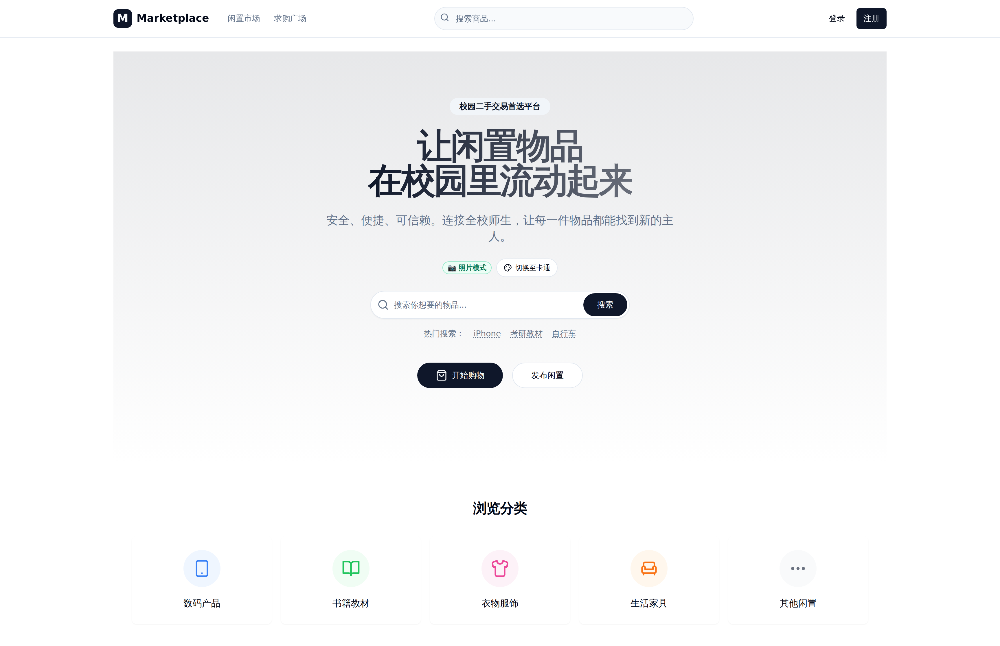
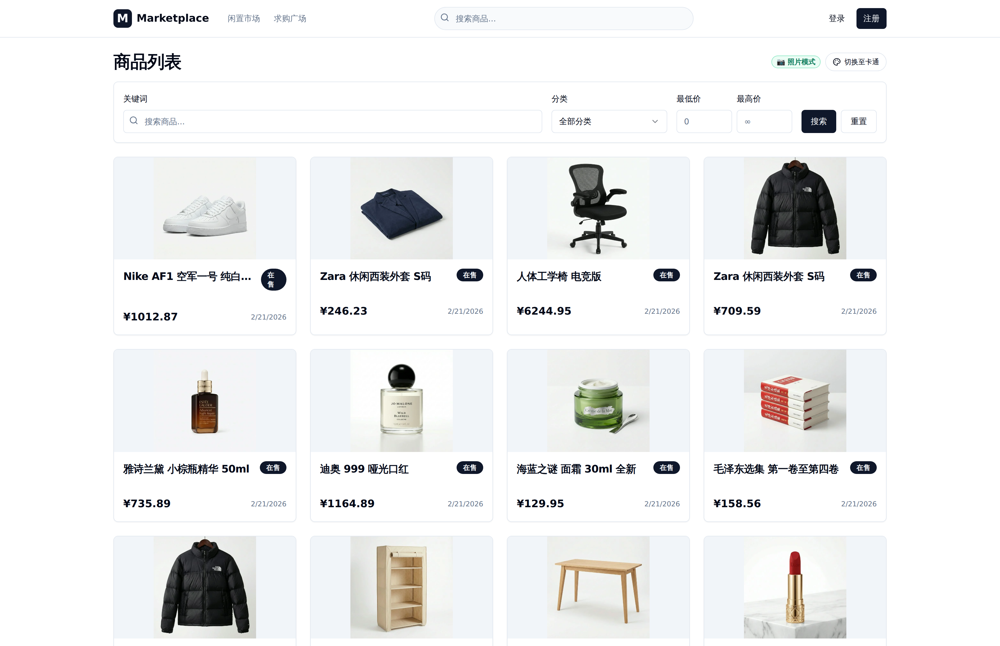
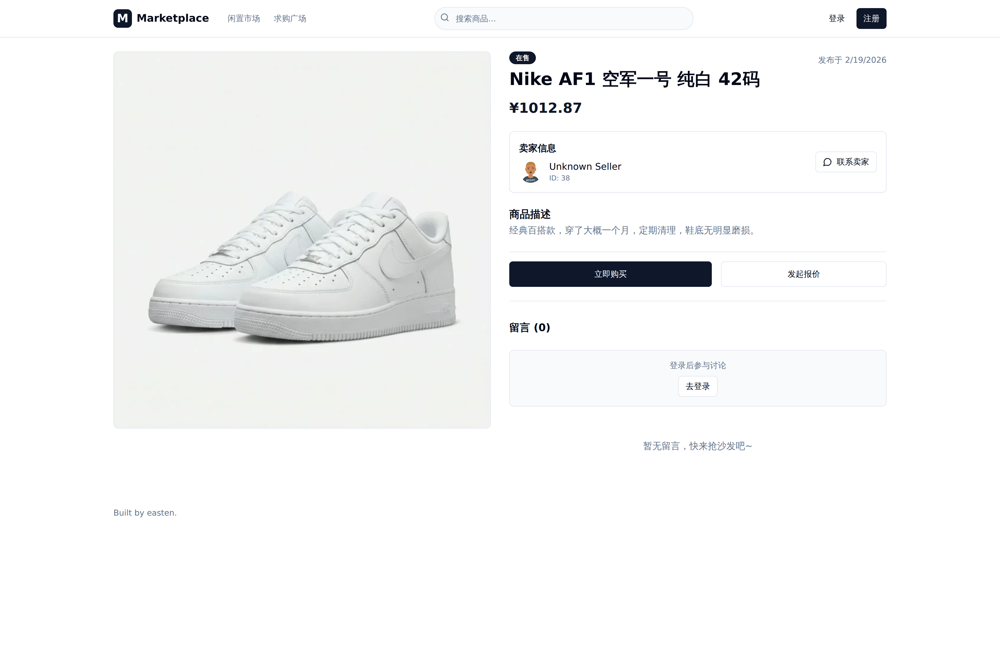
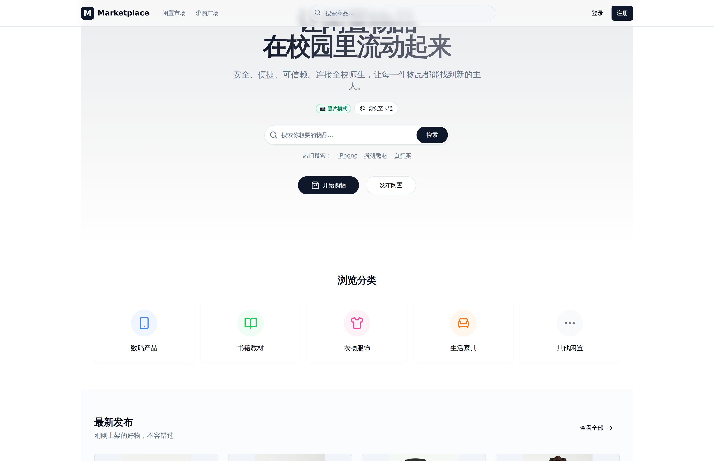
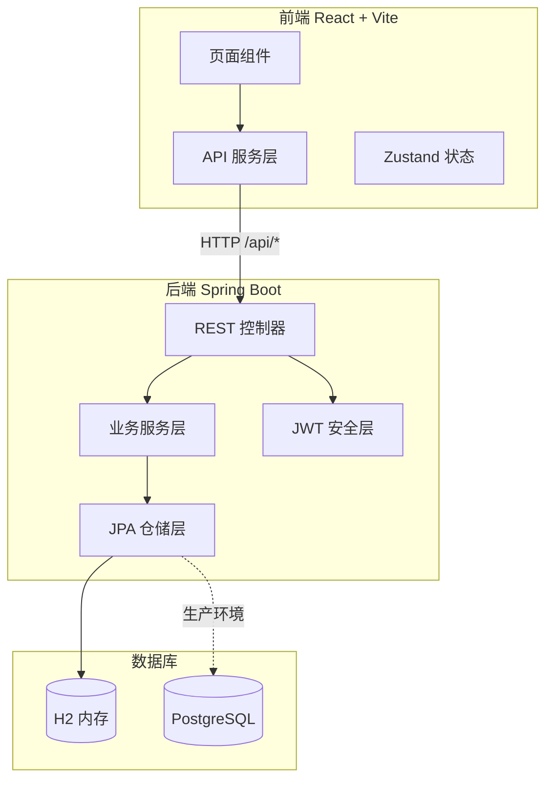
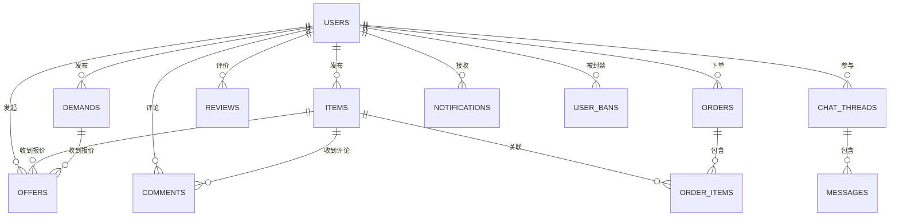
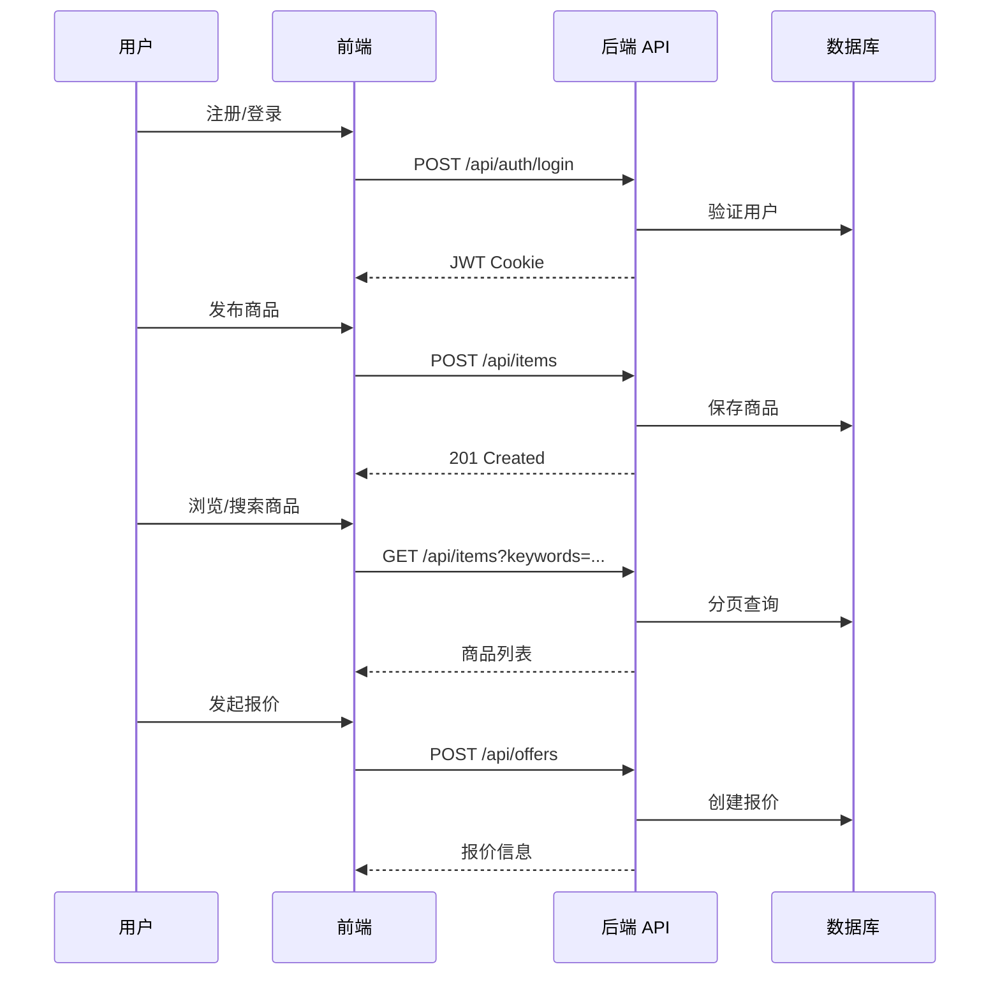

# 🏪 二手交易平台 Secondhand Marketplace

> 基于 **Spring Boot 3.2 + React 18 + H2/PostgreSQL** 的全栈二手交易平台，服务于软件工程课程设计。  
> 从需求分析 → DFD → OOA → 数据库设计 → API 设计 → 前后端实现，完成一个可运行的 MVP。



---

## ✨ 已实现功能

| 模块 | 功能 | 状态 |
|------|------|------|
| **用户认证** | 注册 / 登录 / 退出（JWT HttpOnly Cookie） | ✅ 已实现 |
| **商品管理** | 发布、搜索、详情、上下架（`active/off/deleted` 状态机） | ✅ 已实现 |
| **需求广场** | 求购信息发布、搜索、管理 | ✅ 已实现 |
| **报价系统** | 对商品/需求发起报价；校验金额>0、禁止自报价 | ✅ 已实现 |
| **评论留言** | 针对商品/需求的留言与列表 | ✅ 已实现 |
| **订单管理** | 订单创建与状态流转 | ✅ 已实现 |
| **评价系统** | 交易后评价 | ✅ 已实现 |
| **聊天系统** | 站内消息/聊天线程 | ✅ 已实现 |
| **通知系统** | 系统通知 | ✅ 已实现 |
| **举报与封禁** | 内容举报、用户封禁管理 | ✅ 已实现 |
| **审计日志** | 关键操作写入审计日志 | ✅ 已实现 |
| **图片模式切换** | 照片/卡通双模式切换（`/api/system/image-style`） | ✅ 已实现 |

### 🚧 未实现 / 规划中

- 支付闭环（仅有订单壳，无支付网关对接）
- 实时消息推送（当前为轮询）
- CI/CD 自动化流水线
- Docker 生产部署
- 后台管理面板

---

## 🛠 技术栈

### 后端

| 层级 | 技术 |
|------|------|
| 框架 | Spring Boot 3.2.4, Java 17 |
| Web | Spring Web + Validation |
| 持久层 | Spring Data JPA + Flyway 迁移（9 个版本） |
| 安全 | Spring Security + JWT（jjwt 0.11.5） |
| 数据库 | **H2**（开发/演示）/ **PostgreSQL 15**（生产） |
| 监控 | Spring Boot Actuator |

### 前端

| 层级 | 技术 |
|------|------|
| 框架 | React 18 + TypeScript + Vite 5 |
| 路由 | React Router v6 |
| 状态 | Zustand |
| 表单 | React Hook Form + Zod |
| UI | TailwindCSS + Radix UI + Lucide Icons |

---

## 📁 目录结构

```text
secondhand-marketplace/
├── backend/                           # Spring Boot 后端
│   ├── pom.xml
│   ├── src/main/java/.../marketplace/
│   │   ├── controller/                # 13 个 REST 控制器
│   │   │   ├── AuthController         # 认证
│   │   │   ├── ItemController         # 商品
│   │   │   ├── DemandController       # 需求
│   │   │   ├── OfferController        # 报价
│   │   │   ├── CommentController      # 评论
│   │   │   ├── OrderController        # 订单
│   │   │   ├── ReviewController       # 评价
│   │   │   ├── ChatController         # 聊天
│   │   │   ├── MessageController      # 消息
│   │   │   ├── NotificationController # 通知
│   │   │   ├── ReportController       # 举报
│   │   │   ├── UserBanController      # 封禁
│   │   │   └── SystemController       # 系统设置
│   │   ├── domain/                    # 领域实体
│   │   ├── repository/                # JPA 仓储
│   │   ├── service/                   # 业务逻辑
│   │   └── security/                  # JWT + 过滤器
│   └── src/main/resources/
│       ├── application.yml
│       └── db/migration/              # Flyway V1–V9
├── frontend/                          # React + Vite 前端
│   ├── src/
│   │   ├── pages/                     # 业务页面
│   │   │   ├── auth/                  # 登录/注册
│   │   │   ├── items/                 # 商品列表/详情/发布
│   │   │   ├── demands/               # 需求
│   │   │   ├── orders/                # 订单
│   │   │   ├── messages/              # 消息
│   │   │   ├── me/                    # 个人中心
│   │   │   └── admin/                 # 管理页
│   │   ├── components/                # 通用组件
│   │   ├── services/                  # API 客户端
│   │   └── stores/                    # 状态管理
│   ├── public/demo-assets/            # 演示图片资产
│   └── vite.config.ts                 # 代理 /api → :8080
└── database/
    ├── db-schema.sql                  # DDL 参考
    └── db-design-prompt.md
```

---

## 🚀 快速启动

### 环境要求

- JDK 17+
- Maven 3.8+
- Node.js 18+

> **无需安装 PostgreSQL！** 默认使用 H2 内存数据库，零配置即可运行。

### 一键启动

```bash
# 1. 启动后端（H2 内存数据库，自动建表 + 填充演示数据）
cd backend
mvn spring-boot:run \
  -Dspring-boot.run.arguments="\
    --spring.datasource.url=jdbc:h2:mem:testdb \
    --spring.datasource.driverClassName=org.h2.Driver \
    --spring.datasource.username=sa \
    --spring.datasource.password=password \
    --spring.jpa.database-platform=org.hibernate.dialect.H2Dialect"

# 2. 另开终端，启动前端
cd frontend
npm install
npm run dev
```

启动后访问：**http://localhost:15176**

| 服务 | 地址 | 说明 |
|------|------|------|
| 前端 | `http://localhost:15176` | Vite 开发服务器 |
| 后端 API | `http://localhost:8080` | Spring Boot |
| 健康检查 | `http://localhost:8080/actuator/health` | Actuator |

### 使用 PostgreSQL（可选）

```bash
# 创建数据库
psql -U postgres -c "CREATE USER marketplace WITH PASSWORD 'change-me';"
psql -U postgres -c "CREATE DATABASE marketplace OWNER marketplace;"

# 直接启动（默认 application.yml 配置即用）
cd backend && mvn spring-boot:run
```

---

## 📸 界面预览

| 首页 | 商品列表 |
|------|----------|
|  |  |

| 商品详情 | 图片模式切换 |
|----------|-------------|
|  |  |

---

## 🏗 架构概览



## 🗄 核心数据模型（简化 ERD）



## 🔄 核心业务流程



---

## 📚 设计文档索引

| 文档 | 路径 | 内容 |
|------|------|------|
| API 规范 | `backend/api-spec.md` | RESTful API 接口说明 |
| 数据库设计 | `database/db-schema.sql` | PostgreSQL DDL |
| 后端模块状态 | `backend/backend-components-status.md` | 各模块完成度 |
| 前端计划 | `frontend/前端开发计划.md` | 前端开发规划 |
| 需求分析 | `二手交易平台_结构化需求分析_export.md` | 结构化需求 |
| OOA 分析 | `实验四 面向对象的软件分析.md` | 面向对象分析 |

---

## 📝 已知限制

1. **H2 数据库**：默认使用内存模式，重启后数据丢失。适合演示，不适合持久化。
2. **图片资产**：商品图片为 AI 生成的演示用图，非真实商品照片。
3. **无支付**：订单模块仅有状态流转，无支付网关对接。
4. **无实时推送**：消息/通知依赖前端轮询，无 WebSocket。
5. **单机部署**：无 Docker / K8s 配置，无负载均衡。

---

## 🎓 说明

本仓库为软件工程课程设计项目，旨在展示：
- 从 **需求分析 → DFD → OOA → 数据库 → API → 前后端** 的完整开发链路
- 如何在有限时间内交付可运行的 MVP

如需演进，可优先考虑：支付闭环、WebSocket 实时通信、后台管理面板、Docker 部署。
