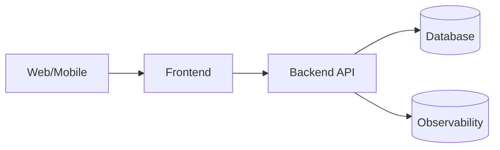
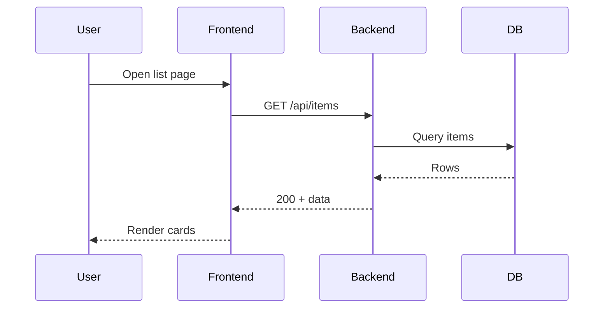
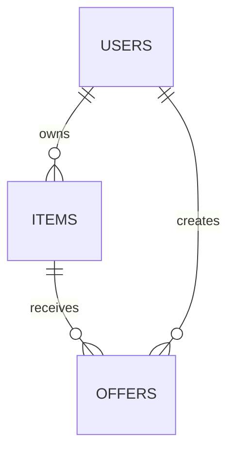

# Project Showcase Template (Text First)

> 通用模板：用于为任意仓库补充 README 项目展示素材。目标是先保证文案真实、结构清晰，再补图表与截图。

## 0) 产出顺序（强制）

1. 文本优化：先完善 README 的目标、边界、功能、限制、运行方式。
2. 事实盘点：从代码/配置中确认“已实现能力”和“规划能力”。
3. 图表生成：仅对已确认事实绘图；规划项必须显式标注 `Planned`。
4. 媒体补充：截图/GIF 只作为证据，不替代正文。

## 1) 图片复用真实性校验（使用前必做）

每张复用图片都要填写以下信息：

- Source: 原始文件路径或采集来源
- Captured At: 采集时间（本地时区）
- Environment: dev/stage/prod + URL
- Version: 分支名/commit 哈希
- Scope: 对应页面/接口/流程
- Validation:
  - 页面路径可访问
  - 接口状态码符合预期
  - UI 与当前代码一致（无旧样式/旧字段）

建议图注格式：

`[Verified] Captured 2026-02-21 00:00 +08:00 on dev(localhost), branch=main, route=/items`

## 2) 图表目录模板（20项候选）

> 不是必须全做。先做高价值项，再按仓库事实补齐。

### A. 强推荐（通常适用于大多数仓库）

1. Hero 运行效果图（主界面截图）
   - 目的：展示“项目已可运行”
   - 最低证据：页面 URL + 时间 + 版本

2. 关键交互 GIF 动图
   - 目的：展示关键链路可用（如 登录 -> 列表 -> 详情 -> 提交）
   - 最低证据：连续操作无报错

3. 简洁系统架构图（高层 Block Diagram）
   - 目的：说明前后端、存储、外部依赖关系
   - 工具：Mermaid flowchart

4. 项目目录结构图
   - 目的：帮助读者快速定位代码
   - 工具：tree + Mermaid 或纯文本树

5. 核心业务流程图（Flow / Swimlane）
   - 目的：说明端到端业务路径

6. 关键时序图（Sequence Diagram）
   - 目的：展示页面/API/服务/数据库调用顺序

7. 数据模型图（ERD 简版）
   - 目的：解释核心实体关系

8. API 调用关系图
   - 目的：展示前端页面到后端接口映射

9. Feature 模块分布图
   - 目的：展示模块边界和职责

10. 技术栈分层图
    - 目的：按表现层/应用层/数据层说明技术职责

### B. 视项目情况补充

11. 数据流图（Data Flow Diagram）
12. 消息队列拓扑图（Messaging Topology）
13. 系统依赖关系图
14. 部署拓扑图（Deployment Diagram）
15. CI/CD 流水线图
16. 运行监控截图（Metrics Dashboard）
17. 性能压测结果图
18. 权限模型图（RBAC/ABAC）
19. 多环境结构图（Dev/Stage/Prod）
20. 容灾架构图（DR Diagram）

## 3) 每张图的标准元数据模板

复制以下块到图下方：

```md
### <图名>
- Type: <screenshot|gif|mermaid|export>
- Status: <Implemented|Planned>
- Source of Truth: <file path / endpoint / config>
- Verified By: <name>
- Verified At: <timestamp>
- Notes: <风险、边界、假设>
```

## 4) Mermaid 模板片段

### 4.1 高层架构图



### 4.2 关键时序图



### 4.3 简版 ERD



## 5) README 填充建议（文本优先）

推荐顺序：

1. 项目一句话定位（做什么、给谁用）
2. 已实现功能（事实）
3. 已知限制（事实）
4. 本地运行步骤（可复现）
5. 图表与截图（证据）
6. 下一步规划（明确 `Planned`）

## 6) 验收清单

- [ ] README 先完成文本优化，再插图
- [ ] 每张图都可追溯到代码/配置/接口
- [ ] 复用图都写了 Verified 信息
- [ ] 所有“规划态”均显式标注
- [ ] 未实现能力未被描述为“已完成”
