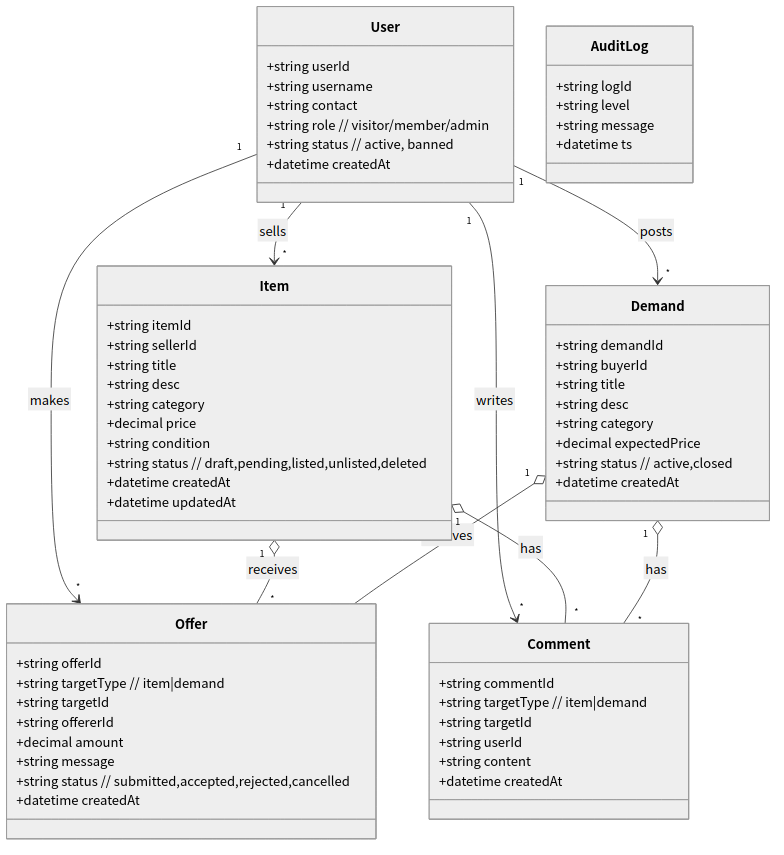

# 实验四 面向对象的软件分析

实验四 面向对象的软件分析

一．实验类型

设计性实验

二．实验目的

掌握面向对象的软件分析方法

三.实验内容和要求

1。用面向对象的分析方法进行软件系统需求分析，得出系统的分析模型（对象模型、动态模型、功能模型).

2．正确运用图表工具进行表示。

3.按规范正确编写软件文档。

四.实验步骤

1．建立问题域的对象模型，确定类与对象、确定关联、确定属性等。(用对象图表示)

对象模型说明：

- **对象识别与职责**
  - 用户（User）：注册/登录、发布、报价、留言与信息维护。
  - 商品（Item）：二手物品信息的聚合根，含标题、描述、价格、状态等。
  - 需求（Demand）：求购信息的聚合根，含期望价格、状态等。
  - 报价（Offer）：围绕商品/需求的报价记录，包含金额、留言、状态。
  - 留言（Comment）：围绕商品/需求的交流记录。
  - 日志（AuditLog）：关键操作记录与审计信息。
- **关键属性（节选）**
  - User：userId, username, contact, role, status, createdAt
  - Item：itemId, sellerId, title, category, price, condition, status, createdAt
  - Demand：demandId, buyerId, title, expectedPrice, status, createdAt
  - Offer：offerId, targetType(item|demand), targetId, offererId, amount, status
  - Comment：commentId, targetType, targetId, userId, content, createdAt
- **关联与多重度（摘要）**
  - 用户 1..1 — 0..* 商品（卖家发布）
  - 用户 1..1 — 0..* 需求（买家发布）
  - 商品/需求 1..1 — 0..* 报价（接收报价）
  - 商品/需求 1..1 — 0..* 留言（信息交流）
- **约束与不变式**
  - 报价金额 > 0；报价者不可为商品卖家/需求发布者（禁止自报价）。
  - 商品状态∈{草稿, 待审, 上架, 下架, 删除}；状态迁移受限（详见状态说明）。

2．建立功能模型,表明系统内的数据如何由输入值得到输出值。（用用例图表示)

功能模型说明：

- **参与者**：游客、会员、管理员（可选）。
- **用例清单（摘要）**
  - 发布信息（商品/需求）：会员提交发布，系统校验并入库/待审。
  - 搜索与查看详情：输入关键词/筛选，查看详情页与历史互动。
  - 发起报价：对目标商品/需求提交报价，系统校验并记录与反馈。
  - 留言互动：围绕目标信息进行交流。
  - 信息管理：会员对自己的发布/报价/留言进行维护。
  - 审核/下架（管理员，可选）：运营侧的内容治理。
- **系统边界**：外部支付、短信/邮件通知等第三方依赖暂以“消息/通知”抽象表示，不纳入本次模型范围。

|用例名：发起报价 参与者：会员|
| -------------------------------------------------------------------------------------------------------------------------------------------------------------------------------------------------------------------------------------------------------------------------------------------------------------------------------------------------------------------------------------------------------------------------------------------------------------------------------------------------------------------------------------------------------------------------------------------------------------------------------------------------------------------------------------------------------------------------------------------------------------------------------------------------------------------------------------------------------------------------------------------------------------------------------------------------------|
|1．前置条件：系统运行，会员可访问目标详情页。 2．后置条件：若成功，则生成一条报价记录并通知目标发布者；若失败，系统状态不变。 3．主事件流 （1）会员在目标商品/需求详情页点击“报价”。 （2）输入报价金额与备注并提交。 （3）系统校验登录状态。 （4）系统校验目标存在且状态为“上架/有效”。 （5）系统校验报价金额合法（>0，且满足平台约束）。 （6）系统校验报价者非目标发布者（禁止自报价）。 （7）系统创建报价记录并持久化。 （8）系统向相关方发送通知（站内/消息）。 （9）系统返回报价成功。 4．备选事件流 4.1未登录→提示先登录，用例结束。 4.2目标不存在/下架→提示目标不可报价，用例结束。 4.3金额非法→提示金额非法，用例结束。 4.4自报价→提示禁止自报价，用例结束。 4.5持久化失败→提示系统操作失败，用例结束。|

3。编写分析文档。

动态模型与一致性说明：

- **顺序图（资产文件，未嵌入正文）**
  - 发起报价：assets/ooa-seq-offer.mmd, assets/ooa-seq-offer.png
  - 发布信息：assets/ooa-seq-publish.mmd, assets/ooa-seq-publish.png
- **状态图（资产文件，未嵌入正文）**
  - 商品/需求状态：assets/ooa-state-item.mmd, assets/ooa-state-item.png（草稿→待审→上架→下架/删除）
- **一致性检查**
  - 名称与数据项与《二手交易平台_结构化需求分析.md》保持一致（用户/商品/需求/报价/留言等实体与字段）。
  - 用例与流程对应于实验三测试对象（口令策略、报价流程），确保约束不冲突。
