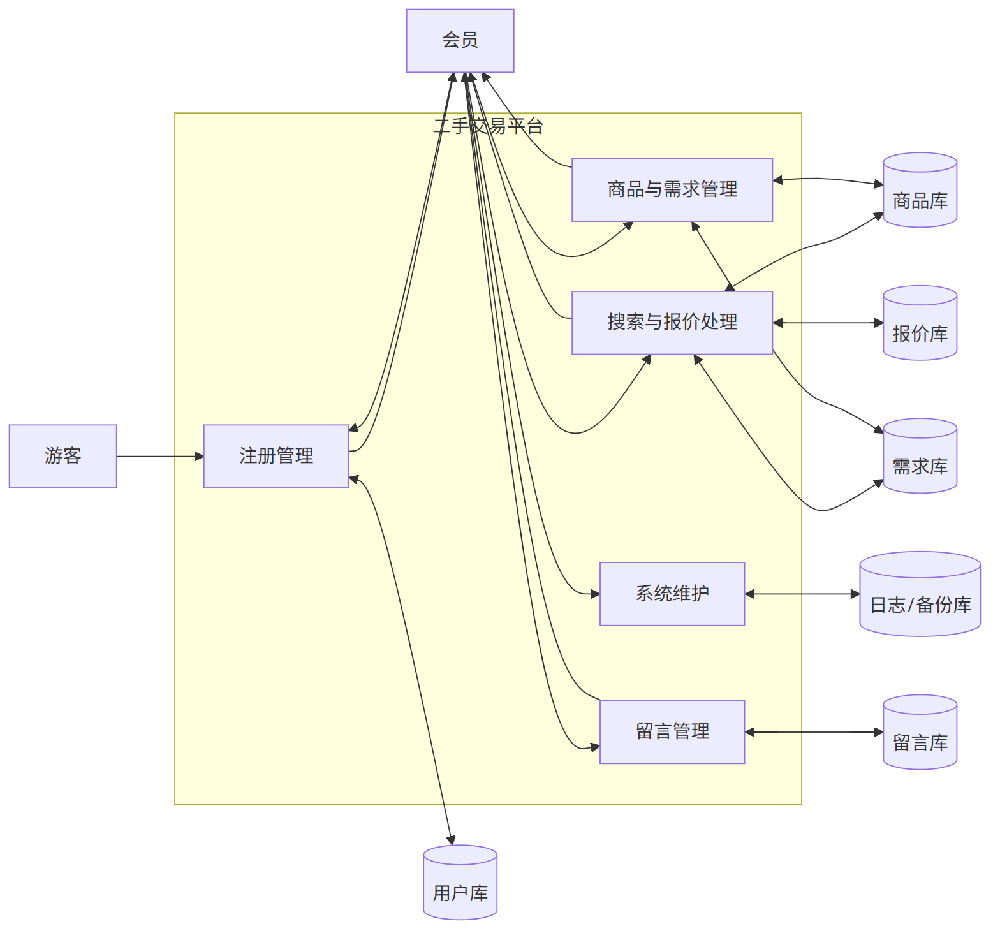
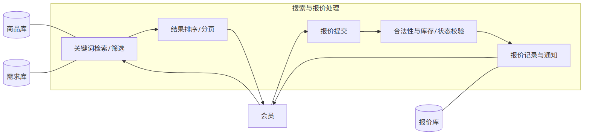
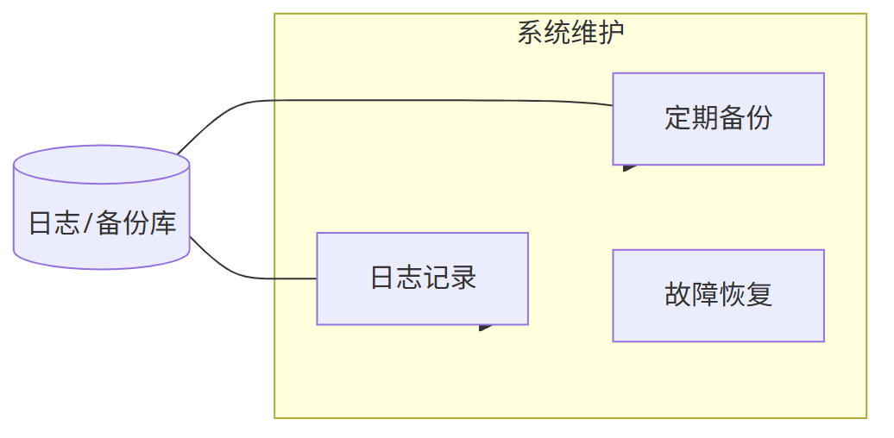
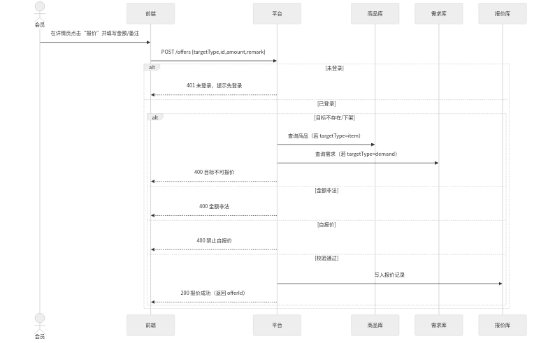
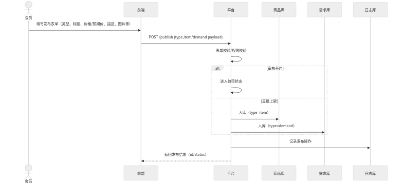
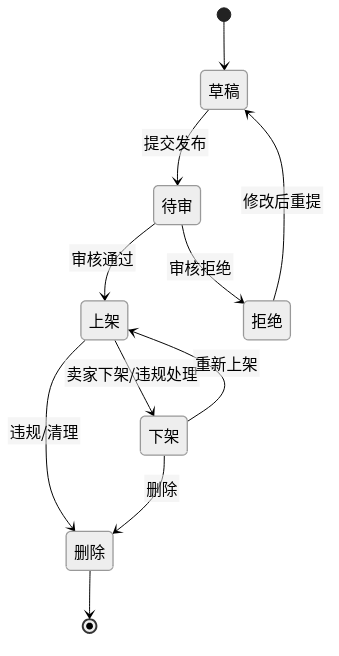

# 软件工程课程设计报告（二手交易平台的需求分析与面向对象设计）

课程名称：软件工程  
设计题目：二手交易平台的需求分析与面向对象设计  
专业班级：23级计算机科学与技术本科5班  
姓 名：查烨凡  
学 号：4123080199  
指导教师：孙增武  

[TOC]

## 1 引言

### 1.1 项目介绍
二手交易平台面向个人用户，提供二手商品与求购信息的发布、检索、详情查看、报价、留言及信息管理等功能，形成注册→信息发布/搜索→互动→管理的闭环。平台提供数据存储、审核、日志和故障恢复等支撑能力，追求稳定、易用与安全。

### 1.2 国内外发展现状
- 海外成熟平台（如 eBay、Facebook Marketplace）实现了便捷的搜索、分类、信誉与消息通知体系，生态完善。
- 国内二手交易应用（如闲鱼、转转）聚焦移动端体验、个体卖家的轻量发布与即时沟通，强调风控与内容治理。
- 技术趋势：前后端分离、搜索与推荐、即时通信、风控审计、可观测性与自动化测试。

### 1.3 相关技术介绍
- 架构：前后端分离（Web/移动端）+ RESTful API + 分层服务（接口层/领域层/数据访问层）。
- 数据：关系型数据库（用户、商品、需求、报价、留言等），必要时引入全文检索与缓存。
- 安全与可靠：会话与权限控制、敏感数据加密、日志审计、备份与容灾、幂等与重试。

## 2 系统可行性分析
- 技术可行性：采用通用 Web 技术栈与关系型数据库，配合检索、消息通知与日志组件，可满足功能与非功能要求。
- 经济可行性：基于现有基础设施部署，初期聚焦开发与测试，运维成本可控。
- 运营可行性：角色清晰、流程直观，配合必要审核策略与后台管理，具备可运营性。

## 3 需求分析

### 3.1 业务范围与角色
- 游客：浏览公开信息、注册成为会员。
- 会员：发布/搜索/查看详情、报价、留言、信息管理（我的发布/报价/留言）。
- 平台：信息汇总、审核、存储、搜索与排序、日志记录与故障恢复。

### 3.2 功能性需求（摘要）
- 访客注册；搜索（商品/需求）；查看详情；发起报价；留言互动；信息管理；（可选）管理员审核/下架。

### 3.3 非功能性需求（摘要）
- 性能：P95 ≤ 2s，核心路径缓存/异步化；可水平扩展。
- 可靠：定期备份与容灾；关键操作幂等与重试。
- 易用：清晰的表单校验与提示；可访问性；移动端适配。
- 安全：身份验证与会话管理；敏感数据传输与存储加密；权限与数据隔离；日志审计。
- 可维护：模块化与分层、良好可读性；监控告警；自动化测试与 CI。

### 3.4 数据流图（DFD）
- 第0层（上下文图）

- 第1层（主要子过程与数据存储）

- 第2层（细化示例：搜索与报价 / 商品与需求 / 系统维护）

### 3.5 用例图

### 3.6 典型用例规约
- 发起报价（会员）
  - 前置：会员可访问目标详情页；目标处于“上架/有效”。
  - 主流程：输入金额与备注→校验登录与目标状态→校验金额与自报价→创建报价记录→通知相关方→返回成功。
  - 备选：未登录/目标无效/金额非法/自报价/持久化失败→对应失败反馈。
- 发布信息（会员）
  - 前置：登录；填写发布表单（类型、标题、价格/预期价、描述、图片）。
  - 主流程：表单与权限校验→（开启审核）待审或（直接上架）入库→记录日志→返回结果与状态。
- 搜索与查看详情（会员）
  - 主流程：输入关键词/筛选→返回结果集合→查看详情（含历史报价与留言）。
- 留言互动（会员）
  - 主流程：在目标详情页提交留言→持久化→返回最新留言列表。
- 信息管理（会员）
  - 主流程：对我的发布/报价/留言进行修改、下架、删除等→返回操作结果。
- 审核/下架（管理员，可选）
  - 主流程：审核内容→通过/拒绝；对违规内容执行下架或删除。

#### 用例规约表（详细）

##### 用例：发布信息（会员）

| 要素 | 内容 |
| --- | --- |
| 参与者 | 会员 |
| 触发条件 | 会员点击发布并提交表单 |
| 前置条件 | 已登录；表单项有效 |
| 后置条件 | 生成信息记录：待审或上架；记录日志 |
| 主事件流 | 1. 填写表单 2. 表单/权限校验 3. 审核开关判断 4a. 待审 4b. 上架入库 5. 记录日志 6. 返回结果 |
| 备选事件流 | 未登录/字段非法/权限不足/持久化失败 → 返回错误 |

##### 用例：搜索与查看详情（会员）

| 要素 | 内容 |
| --- | --- |
| 参与者 | 会员 |
| 触发条件 | 输入关键词/筛选并查询 |
| 前置条件 | 系统可用；索引可用（如适用） |
| 后置条件 | 返回结果列表；可浏览详情 |
| 主事件流 | 1. 输入关键词/筛选 2. 发起查询 3. 查询库或索引 4. 返回分页结果 5. 查看详情（含历史报价/留言） |
| 备选事件流 | 无结果/系统错误 → 友好提示 |

##### 用例：发起报价（会员）

| 要素 | 内容 |
| --- | --- |
| 参与者 | 会员 |
| 触发条件 | 在详情页点击“报价”并提交金额 |
| 前置条件 | 已登录；目标处于上架/有效状态；报价者≠发布者 |
| 后置条件 | 生成报价记录并通知相关方 |
| 主事件流 | 1. 输入金额/备注 2. 校验登录 3. 校验目标有效 4. 校验金额>0与平台约束 5. 校验非自报价 6. 写入报价库 7. 通知 8. 返回成功 |
| 备选事件流 | 未登录/目标无效/金额非法/自报价/持久化失败 → 返回错误 |

##### 用例：留言互动（会员）

| 要素 | 内容 |
| --- | --- |
| 参与者 | 会员 |
| 触发条件 | 在详情页提交留言 |
| 前置条件 | 已登录；目标存在 |
| 后置条件 | 留言持久化并可见 |
| 主事件流 | 1. 输入留言 2. 校验 3. 写入留言库 4. 返回最新列表 |
| 备选事件流 | 内容违规/系统错误 → 返回错误 |

##### 用例：信息管理（会员）

| 要素 | 内容 |
| --- | --- |
| 参与者 | 会员 |
| 触发条件 | 在“我的”中对发布/报价/留言进行操作 |
| 前置条件 | 已登录；具备资源所有权 |
| 后置条件 | 目标资源被更新/下架/删除；返回操作结果 |
| 主事件流 | 1. 选择资源与操作 2. 权限与状态校验 3. 持久化 4. 返回结果 |
| 备选事件流 | 越权/状态不允许/并发冲突 → 返回错误 |

### 3.7 数据字典（节选）
- 实体/存储：
  - 用户库：user_id, username, password_hash, phone/email, status, created_at
  - 商品库：item_id, seller_id, title, desc, category, price, condition, images, status, created_at, updated_at
  - 需求库：demand_id, buyer_id, title, desc, category, expected_price, status, created_at
  - 报价库：offer_id, target_type(item/demand), target_id, offerer_id, amount, message, status, created_at
  - 留言库：comment_id, target_type, target_id, user_id, content, created_at
  - 日志/备份库：log_id, level, message, ts / backup_id, snapshot_ref, ts
- 关键数据流数据项（示例）：注册申请、搜索请求/结果、报价请求/反馈、发布请求/反馈、留言请求/列表、信息管理请求/结果。

#### 3.7.1 字段类型与约束（节选）

| 实体 | 字段 | 类型 | 约束 | 来源/去向 |
| --- | --- | --- | --- | --- |
| users | user_id | BIGINT | PK | 生成/引用 |
| users | username | VARCHAR(50) | UNIQUE, NOT NULL | 注册/登录 |
| users | password_hash | VARCHAR(255) | NOT NULL | 注册/鉴权 |
| items | item_id | BIGINT | PK | 生成/引用 |
| items | seller_id | BIGINT | FK→users.user_id | 关联用户 |
| items | title | VARCHAR(100) | NOT NULL | 发布/搜索索引 |
| items | price | DECIMAL(10,2) | CHECK > 0 | 发布/展示 |
| demands | expected_price | DECIMAL(10,2) | CHECK > 0 | 发布/展示 |
| offers | offer_id | BIGINT | PK | 生成/引用 |
| offers | amount | DECIMAL(10,2) | CHECK > 0 | 报价/展示 |
| comments | content | TEXT | NOT NULL | 留言/展示 |

## 4 概要设计

### 4.1 总体架构
- 表现层（Web/移动端）→ 接口层（REST）→ 领域服务层（用户/商品/需求/报价/留言）→ 数据访问层（DAO/仓储）。
- 外部依赖抽象：通知/消息、对象存储（图片）、日志与监控。

### 4.2 模块与职责
- 用户模块、商品模块、需求模块、报价模块、留言模块、审核与日志模块。

### 4.3 关键接口（示例）
- POST /api/register, POST /api/login
- GET /api/items?keywords&filters，GET /api/items/{id}
- POST /api/items | /api/demands（发布）
- POST /api/offers（发起报价）
- POST /api/comments（留言）
- PATCH /api/items/{id}（下架/更新）

### 4.4 数据库设计（概念/逻辑草案）
- 表：users(items, demands, offers, comments, audit_logs)；字段取自数据字典，主键与外键按实体关系约束。

### 4.5 模块接口清单（扩展）

| 接口 | 方法 | 主要请求字段 | 主要响应 | 说明 |
| --- | --- | --- | --- | --- |
| POST /api/register | POST | username, password, contact | result_code | 注册 |
| GET /api/items | GET | keywords, filters, page,size | items[], total | 搜索商品 |
| GET /api/items/{id} | GET | id | item, offers, comments | 详情 |
| POST /api/items | POST | item payload | id,status | 发布商品 |
| POST /api/demands | POST | demand payload | id,status | 发布需求 |
| POST /api/offers | POST | targetType,id,amount | offer_id | 报价 |
| POST /api/comments | POST | targetType,id,content | comment_id | 留言 |
| PATCH /api/items/{id} | PATCH | action/update payload | result | 下架/更新 |

### 4.6 表结构草案（节选）

| 表：items | 类型 | 约束 | 说明 |
| --- | --- | --- | --- |
| item_id | BIGINT | PK | 主键 |
| seller_id | BIGINT | FK→users.user_id | 卖家 |
| title | VARCHAR(100) | NOT NULL | 标题 |
| desc | TEXT |  | 描述 |
| category | VARCHAR(50) |  | 类别 |
| price | DECIMAL(10,2) | CHECK > 0 | 价格 |
| condition | VARCHAR(20) |  | 成色 |
| status | VARCHAR(10) | IN(draft,pending,active,off,deleted) | 状态 |

| 表：offers | 类型 | 约束 | 说明 |
| --- | --- | --- | --- |
| offer_id | BIGINT | PK | 主键 |
| target_type | VARCHAR(10) | IN(item,demand) | 目标类型 |
| target_id | BIGINT |  | 目标ID |
| offerer_id | BIGINT | FK→users.user_id | 报价者 |
| amount | DECIMAL(10,2) | CHECK > 0 | 金额 |
| status | VARCHAR(10) |  | 状态 |

## 5 详细设计

### 5.1 核心类职责（示例）
- ItemService：发布/更新/上下架，查询详情。
- OfferService：校验与创建报价，通知。
- CommentService：新增与列表。
- 审核服务：内容审核策略与状态迁移。

### 5.2 关键流程时序
- 发起报价顺序图：

- 发布信息顺序图：

- 状态图（商品/需求）：

### 5.3 类与方法说明（节选）

| 类 | 主要属性 | 关键方法 |
| --- | --- | --- |
| ItemService | repo, validator, audit | publish(item), update(id,payload), changeStatus(id,action), getDetail(id) |
| OfferService | repo, notifier | createOffer(req), validate(req), listByTarget(t) |
| CommentService | repo, sanitizer | addComment(req), list(target) |

## 6 系统测试

### 6.1 测试策略
- 功能测试：覆盖核心用例（注册、发布、搜索、报价、留言、信息管理）。
- 非功能：性能（P95≤2s）、可靠性（备份/恢复演练）、安全（鉴权、越权、注入）。

### 6.2 典型用例（示例）
- 用例：发起报价 成功路径  
  前置：登录，目标上架；步骤：输入金额→提交→成功返回；期望：HTTP 200，生成记录并通知。  
- 用例：发起报价 金额非法  
  前置：登录；步骤：amount≤0；期望：HTTP 400，错误消息。  
- 用例：发布信息 待审开关  
  步骤：开启审核→提交；期望：状态=待审；关闭→直接上架。  

### 6.3 测试用例表（更多）

| ID | 用例 | 前置 | 步骤 | 期望 |
| --- | --- | --- | --- | --- |
| TC-REG-001 | 注册成功 | 无 | 输入合法用户名/口令→提交 | 200，用户入库 |
| TC-ITEM-002 | 发布非法金额 | 登录 | price<=0→提交 | 400，错误提示 |
| TC-SEARCH-003 | 搜索无结果 | 无 | keywords=稀有关键词 | 200，total=0，友好提示 |
| TC-OFFER-004 | 自报价拦截 | 登录为卖家 | 对自家商品报价 | 400，禁止自报价 |
| TC-COMM-005 | 留言成功 | 登录 | 提交留言 | 200，返回最新留言 |

## 参考文献（示例）
- Pressman R. 软件工程实践者的研究方法.
- Fowler M. 分析模式/企业应用架构模式.
- GB/T 25000 系列（软件工程 软件产品质量要求与评价）。

（以上草稿与现有资料一致；待最终定稿时按模板字号/行距/图表编号进行排版调整。）

## 致谢

感谢指导教师孙增武老师在课题选题、文档结构与方法论上的悉心指导；亦感谢课程助教与同学们在需求澄清、模型校验与文档审阅中的建议与帮助。

## 附录

### 附录A 术语表

| 术语 | 说明 |
| --- | --- |
| DFD | 数据流图（Data Flow Diagram） |
| ER  | 实体-联系模型（Entity-Relationship） |
| P95 | 第95百分位响应时间 |

### 附录B 资源清单

- DFD 图片：images/dfd-0.png, dfd-1.png, dfd-2a.png, dfd-2b.png, dfd-2c.png
- OOA 图与源文件：
  - 实验四 面向对象的软件分析.md/assets/ooa-usecase.png（.mmd）
  - 实验四 面向对象的软件分析.md/assets/ooa-domain-class.png（.mmd）
  - 实验四 面向对象的软件分析.md/assets/ooa-seq-offer.png（.mmd）
  - 实验四 面向对象的软件分析.md/assets/ooa-seq-publish.png（.mmd）
  - 实验四 面向对象的软件分析.md/assets/ooa-state-item.png（.mmd）
